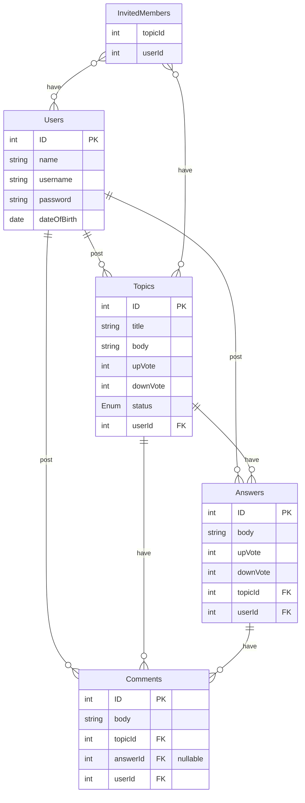
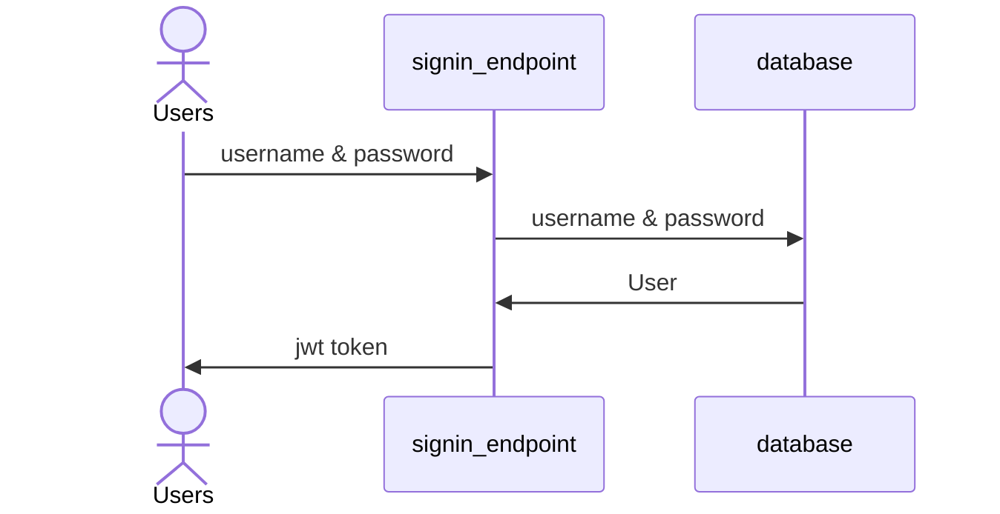
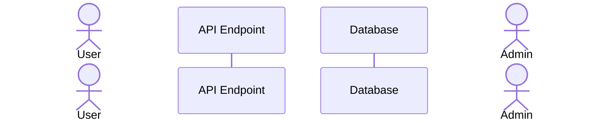

- Discussion Forum is a website application that is intended to be a media for people to discuss about their ideas.
- User can create a topic they wanted to discuss about.
    - the topic can be set to be private so that only invited people can join the discussion. and can not be searched
    - set to protected, it is similar to private but is searchable.
    - and also set to be public so anybody can join the discussion and is searchable.
- User can comment to the topic or can post and answer to the topic.
    - an answer can be commented to.
- It has a vote system to answer with the most post will occur first.
- it has search feature so you can search for a topic.

## ER Diagram



## API Contracts
### Sign In
- Reqeust
	- Method: POST
	- URI: /signin
	- Body:
		- `username`
		- `password`
- Response: 
	- Status code: 200
	- Body: 
```json 
{"token": jwt-token}
```




### Sign Up
- Request: 
	- URI: /signup
	- Method: POST
	- Body:
		- `Name`
		- `DateofBirth`
		- `Username`
		- `Password`
- Response:
	- Status code: 200
	- Body:
```JSON
{
"Message": "Successfully Create your account, wait for admin to activate your account :)"
}
```


### Create Topic
- Request:
	- URI: `/topics`
	- Method: `POST`
	- Header: `Authorization: Bearer jwt-token`
	- Body: 
```JSON
{
	"title": "title", 
	"description": "description", 
	"status": ("private", "protected", "public")
}		 
```
- Response:
	- Status code: `200`
	- Header: `Location: /topics/:id`
	- Body: 
```JSON
{
	"id": 1, 
	"title": "title", 
	"description": "description", 
	"status": ("private", "protected", "public")
}		 
```
```mermaid
sequenceDiagram

```

### Retrieve Topic
- Request:
	- URI: `/topics`
	- Method: `GET`
- Response:
	- Status code: `200`
	- Body:
```JSON
{
	"id": 0, 
	"username": "username", 
	"title": "title", 
	"description": "description", 
	"upvote": 0, 
	"downvote": 0, 
	"comments": [
		{
			"id": 0, 
			"username": "username", 
			"body": "text"
		}, 
		{
			"id": 0, 
			"username": "username", 
			"body": "text"
		}
	], 
	"Answer": [
		{
			"id": 0, 
			"username": "username", 
			"body": "text", 
			"upvote": 0, 
			"downvote": 0
		}, 
		{
			"id": 0, 
			"username": "username", 
			"body": "text", 
			"upvote": 0, 
			"downvote": 0
		}, 
	]
}
```
### Update Topic
- Request: 
	- URI: `/topics/:id`
	- Method: `PUT`
	- Header: `Authorization: Bearer jwt-token`
	- Body:
```JSON
{
	"title": "title", 
	"description": "description", 
	"status": ("private", "protected", "public")
}	
```
- Response:
	- Status code: `204`
	- Body: `nil`

### Delete Topic
- Request: 
	- URI: `/topics/:id`
	- Method: `DELETE`
	- Header: `Authorization: Bearer jwt-token`
	- Body: `nil`
- Response:
	- Status code: `204`
	- Body: `nil`


### Create Answer
- Request: 
	- URI: `/answers`
	- Method: `POST`
	- Header: `Authorization: Bearer jwt-token`
	- Body:
```JSON
{
	"topicId": 0, 
	"body": "text"
}
```
- Response:
	- Status code: `200`
	- Header: `Location: /answer/:id`
	- Body: 
```JSON
{
	"topicId": 0, 
	"body": "text"
}
```
### Update Answer
- Request: 
	- URI: `/answers/:id`
	- Method: `PUT`
	- Header: `Authorization: Bearer jwt-token`
	- Body: 
```JSON
{
	"body": "text"
}
```
- Response:
	- Status code: `204`
	- Body: `nil`
### Delete Answer
- Request: 
	- URI: `/answers/:id`
	- Method: `DELETE`
	- Header: `Authorization: Bearer jwt-token`
	- Body: `nil`
- Response:
	- Status code: `204`
	- Body: `nil`
### Create Comment
- Request: 
	- URI: `comments/`
	- Method: `POST`
	- Header: `Authorization: Bearer jwt-token`
	- Body:
```JSON
{
	"body": "body", 
	"topicId": 0, 
	"answerId": nil, 
	"userId": 0
}
```
- Response:
	- Status code: `200`
	- Body: 
```JSON
{
	"body": "body", 
	"topicId": 0, 
	"answerId": nil, 
	"userId": 0
}
```
### Update Comment
- Request: 
	- URI:`comments/:id`
	- Method: `PUT`
	- Header: `Authorization: Bearer jwt-token`
	- Body: 
```JSON
{
"body": "body"
}
```
- Response:
	- Status code: `204`
	- Body: `nil`
### Delete Comment
- Request: 
	- URI: `comments/:id`
	- Method: `DELETE`
	- Header: `Authorization: Bearer jwt-token`
	- Body: `nil`
- Response:
	- Status code: `204`
	- Body: `nil`
### Update User
- Request: 
	- URI: `users/:id`
	- Method: `PUT`
	- Header: `Authorization: Bearer jwt-token`
	- Body: 
```JSON
{
	"name": "name", 
	"username": "username", 
	"dateOfBirth": "20/01/2023"
}
```
- Response:
	- Status code: `204`
	- Body: `nil`
### Delete User
- Request: 
	- URI: `users/:id`
	- Method: `DELETE`
	- Header: `Authorization: Bearer jwt-token`
	- Body: `nil`
- Response:
	- Status code: `204`
	- Body: `nil`
### Up Vote Topic
- Request: 
	- URI: `topics/:id/up`
	- Method: `PUT`
	- Header: `Authorization: Bearer jwt-token`
	- Body: `nil`
- Response:
	- Status code: `204`
	- Body: `nil`
### Down Vote Topic
- Request: 
	- URI: `topics/:id/down`
	- Method: `PUT`
	- Header: `Authorization: Bearer jwt-token`
	- Body: `nil`
- Response:
	- Status code: `204`
	- Body: `nil`
### Up Vote Answer
- Request: 
	- URI: `answers/:id/up`
	- Method: `PUT`
	- Header: `Authorization: Bearer jwt-token`
	- Body: `nil`
- Response:
	- Status code: `204`
	- Body: `nil`
### Down Vote Answer
- Request: 
	- URI: `answers/:id/down`
	- Method: `PUT`
	- Header: `Authorization: Bearer jwt-token`
	- Body: `nil`
- Response:
	- Status code: `204`
	- Body: `nil`
### Search Topics
- Request: 
	- URI: `search/?keyword=abc&sort=desc|vote|latest|oldest|asc`
	- Method: `GET`
	- Body: `nil`
- Response:
	- Status code: `200`
	- Body: 
```JSON
[
	{
		"id": 0, 
		"username": "username", 
		"title": "title", 
		"description": "description", 
		"upvote": 0, 
		"downvote": 0,
	}, 
	{
		"id": 0, 
		"username": "username", 
		"title": "title", 
		"description": "description", 
		"upvote": 0, 
		"downvote": 0,
	}, 
	{
		"id": 0, 
		"username": "username", 
		"title": "title", 
		"description": "description", 
		"upvote": 0, 
		"downvote": 0,
	}, 
]
```

### Invite Users
- Request:
	- URI: `users/:id/invite`
	- Method: `POST`
	- Header: `Authorization: Bearer jwt-token`
	- Body: `nil`
- Response:
	- Status code: `204`
	- Body: `nil`
